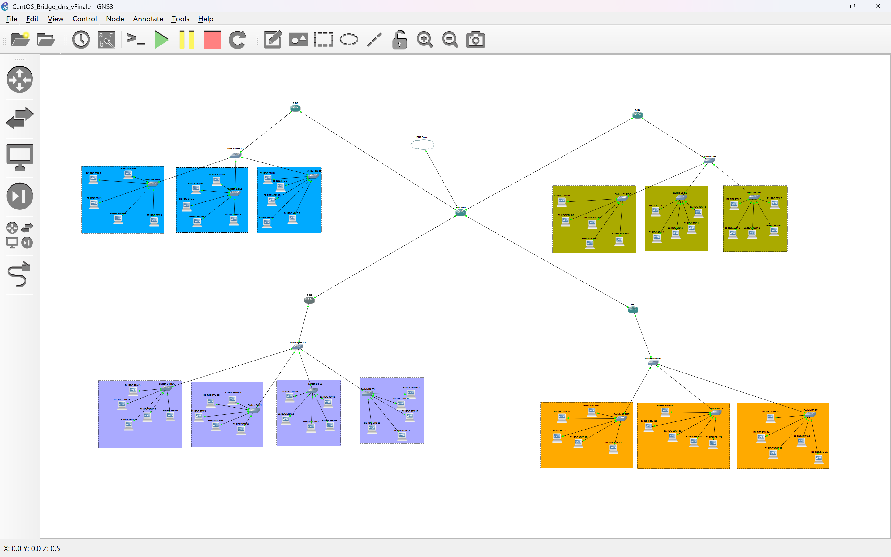
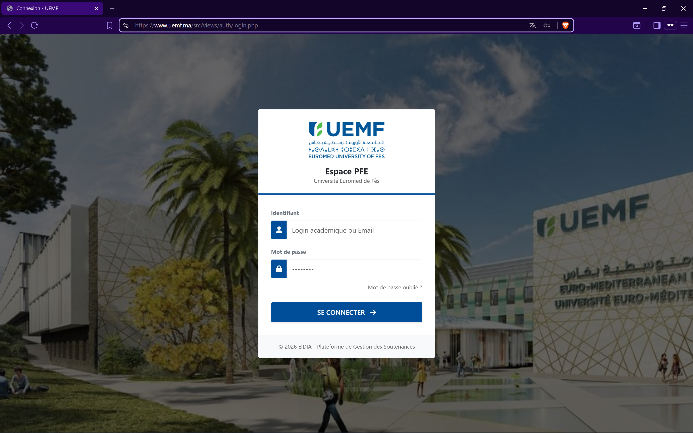

#  Architecture Réseau Campus & Hébergement Web Sécurisé (GNS3)


> **Projet individuel d'ingénierie réseau** simulant l'infrastructure complète de l'université UEMF. Ce lab déploie un réseau multisite (OSPF/VLANs) et héberge l'application web "Gestion-Soutenances" sur une VM Linux, sécurisée via **HTTPS**.

L'application est accessible localement depuis la machine hôte (Windows) via l'URL :
 **`https://www.uemf.ma/src/views/auth/login.php`**


---

##  1. Objectifs Techniques

Ce projet vise à créer un environnement de production réaliste et sécurisé.
* **Interconnexion Multisite :** Liaison de 4 bâtiments via un cœur de réseau Gigabit.
* **Sécurité Applicative :** Chiffrement des communications Web via **SSL/TLS (HTTPS)**.
* **Accessibilité Transverse :** Pont réseau permettant l'accès au site depuis Windows.
* **Services Critiques :** DNS autoritaire (`uemf.ma`) et DHCP distribué.

---

##  2. Architecture & Topologie

### Structure Physique
Le réseau s'articule autour d'un **Cœur de Réseau (R-ADMIN)** qui interconnecte les routeurs de distribution des bâtiments (R-B1 à R-B4).


*(Voir le fichier `topology.gns3` pour la configuration complète)*

### Segmentation (VLANs)
Une politique de segmentation uniforme est appliquée sur tous les switchs d'accès :

| VLAN ID | Nom | Plage IP | Usage |
| :---: | :--- | :--- | :--- |
| **10** | `STAFF_PROFS` | `10.x.10.0/24` | Administration & Professeurs |
| **20** | `STUDENTS` | `10.x.20.0/24` | Zone Étudiants & Labos |
| **30** | `VOIP` | `10.x.30.0/24` | Téléphonie IP |
| **50** | `MANAGEMENT` | `10.x.50.0/24` | Gestion des équipements |

---

##  3. Configuration Serveur (VM CentOS 8)

Le serveur (`192.168.119.135`) est situé dans la DMZ. Il assure les rôles de serveur Web Sécurisé et DNS.

### A. Hébergement Web & SSL (Apache)
L'application est servie via Apache HTTPD configuré avec le module `mod_ssl` sur le port 443.
* **Protocole :** HTTPS (Certificat auto-signé pour le lab).
* **Chemin d'accès :** `/var/www/html/src/views/auth/login.php`
* **URL :** `https://www.uemf.ma/src/views/auth/login.php`

### B. Service DNS (Bind9)
Le serveur est l'autorité pour la zone `uemf.ma`. Il permet à Windows de résoudre le domaine localement.

>  **Preuves de configuration :**
> * [Voir la configuration DNS & Web (server_config.txt)](proofs/server_config.txt)

---

##  4. Configuration Réseau (GNS3)

### A. Routage OSPF (Area 0)
Le routeur (`R-ADMIN`) centralise les routes de tous les bâtiments via le protocole OSPF. Tous les voisinages sont en état `FULL`.

>  **Preuves de Routage :**
> * [Voir la table de voisinage OSPF & Routes (network_ospf.txt)](proofs/network_ospf.txt)

### B. DHCP Distribué
Chaque bâtiment gère ses propres baux DHCP et distribue l'adresse du serveur DNS (`192.168.119.135`).

**Exemple obtenu par un client étudiant (Bâtiment 1) :**
```text
B1-RDC-ETU-5> show ip
NAME        : B1-RDC-ETU-5[1]
IP/MASK     : 10.2.20.2/24
GATEWAY     : 10.2.20.1
DNS         : 192.168.119.135
DHCP SERVER : 10.2.20.1
```

>  **Preuves DHCP Complètes :**
> * [Voir les Pools DHCP par bâtiment (network_dhcp.txt)](proofs/network_dhcp.txt)

---

##  5. Validation & Tests (Windows & Clients)

### A. Accès depuis l'Hôte Windows (Pont Réseau)
Le test de Ping confirme que le nom de domaine `www.uemf.ma` est bien résolu par notre serveur DNS Linux depuis Windows.

```dos
PS C:\Users\RR> ping www.uemf.ma
Pinging www.uemf.ma [192.168.119.135] with 32 bytes of data:
Reply from 192.168.119.135: bytes=32 time<1ms TTL=64
Reply from 192.168.119.135: bytes=32 time<1ms TTL=64
```

### B. Accès Web Sécurisé (Navigateur)
L'accès à l'application via le navigateur valide la chaîne complète : DNS → Routage → Apache SSL → PHP.

**URL testée :** `https://www.uemf.ma/src/views/auth/login.php`



*(Le cadenas de sécurité s'affiche, et la page de connexion de l'application apparaît correctement, prouvant que le trafic HTTPS passe par le réseau simulé).*

  **LOGS COMPLETS DES TESTS :**
> *  [Voir le fichier de preuves (Ping Windows, VPCS, Routeurs)](proofs/connectivity_tests.txt)

---